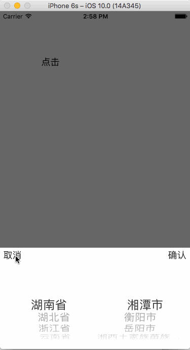

# NTAddressPickerView
##### 这是一个二级的地址选择器

* 使用方法

```
/*
 * @param animated : 是否进行动画
 * @param cancelBlock : 点击取消按钮所进行的操作（block）
 * @param confirmBlock : 点击确认按钮所进行的操作（block）
 */

+ (void)showAddressPickerViewWithAnimated :(BOOL)animated cancelAction: (CancelBlock)cancelBlock confirmBlock: (ConfirmBlock)confirmBlock;

```
* 效果展示


